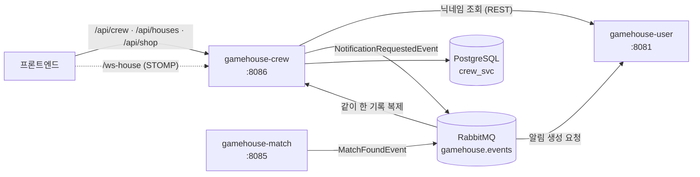

# gamehouse-crew

GameHouse의 **하우스(크루)** 서비스. 유저가 하우스를 만들어 사람을 모으고,
공지·일정·채팅으로 함께 활동하며, 주간 퀘스트와 상점으로 하우스를 키우는 기능을 담당한다.

---

## 1. 좌표

GameHouse는 서비스별로 레포가 분리된 MSA다. 이 레포는 그중 `crew` 하나다.

| 서비스 | 포트 | 담당 |
|---|---|---|
| `gamehouse-user` | 8081 | 회원·인증·친구·알림 |
| `gamehouse-post` | 8082 | 모집글·파티 |
| `gamehouse-chat` | 8083 | 1:1 · 파티 채팅 |
| `gamehouse-riot` | 8084 | Riot API 연동 |
| `gamehouse-match` | 8085 | AI Team Fit 추천 |
| **`gamehouse-crew`** | **8086** | **하우스(크루)** |

공통 코드(JWT 검증, 전역 예외 처리, 이벤트 계약)는 `gamehouse-common`을
GitHub Packages에서 받아 쓴다. 배포 매니페스트는 `infra` 레포에 있다.

---

## 2. 서비스 관계도

**이벤트로 주고받는 이유는 DB 권한 경계 때문이다.** 서비스마다 DB 계정과 스키마가 갈라져
있어서, crew는 `match_svc`도 `user_svc`도 읽거나 쓸 수 없다. 그래서 추천에 필요한
"누가 누구와 같이 게임했는지"는 `MatchFoundEvent`로 받아 `crew_svc`에 복제해 두고,
알림은 직접 넣는 대신 `NotificationRequestedEvent`로 user에게 요청만 보낸다.

crew가 직접 호출하는 서비스는 닉네임 조회를 위한 **user 하나**뿐이다.

---

## 3. 담당 도메인

| 도메인 | 하는 일 |
|---|---|
| **하우스** | 생성·수정·가입 신청·승인/거절·역할 변경·추방 |
| **초대** | 하우스장이 유저를 초대하고, 받은 쪽이 수락/거절 |
| **공지** | 하우스 내 공지 작성·수정·상단 고정·삭제 |
| **일정** | 일정 등록과 참가 신청/취소 |
| **채팅** | 하우스 단체 채팅 (STOMP over RabbitMQ) |
| **랭킹** | 주 단위 활동량 스냅샷으로 하우스 순위 산출 |
| **퀘스트** | 주간 퀘스트 진행도와 보상 수령 |
| **상점** | 하우스 재화로 아이템 구매·인벤토리·장착 토글 |
| **추천** | 매칭으로 함께 플레이했던 유저를 추천 |
